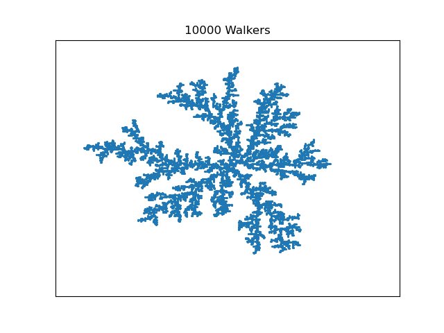
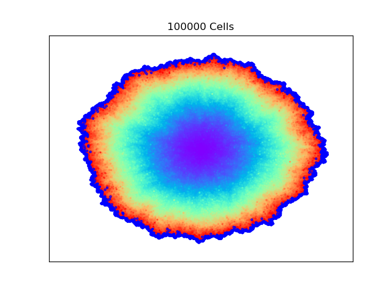

## Week 1 (Due May 23)
- Have implemented a random walker function that randomly takes a step forward or backward, but cannot return back to where it came from
- Have implemented an animation function to visualize the evolution of the random walker's position

- TODO:
  - Implement seeds that random walkers can cling to if touching

## Week 2 (Due May 30)
- Successfully have shown that clustering algorithm gives qualitatively expected results

- Currently, the code is too slow to do the simulation we are ultimately hoping to do. Will work on optimizing code
- Will transition towards dielectric breakdown model soon.

## Week 3 (Due June 6)
- Have optimized the DLA algorithm to be over twice as effecient. Can now produce clusters with 1000's of random walkers

- Color coordinate the scatter plot of the walkers so that the order of arrival to the cluster is evident (blue points are early walkers, red are the late comers). Gives interesting insight into how walkers attach to cluster

- Have implemented Eden model (tumor growth, dielectric breakdown). Code is effecient and can simulate very large number of cells.

- TODO list
- [ ] implement probabilistic clustering
- [x] implement Eden model
- [x] implement correlation function
- [x] compare Hausdorff dimension from DLA model to literature
- [ ] apply Eden to dielectric breakdown
- [ ] compare Hausdorff dimension with DLA and Eden in dielectric breakdown
